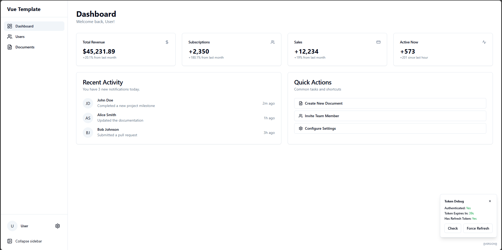
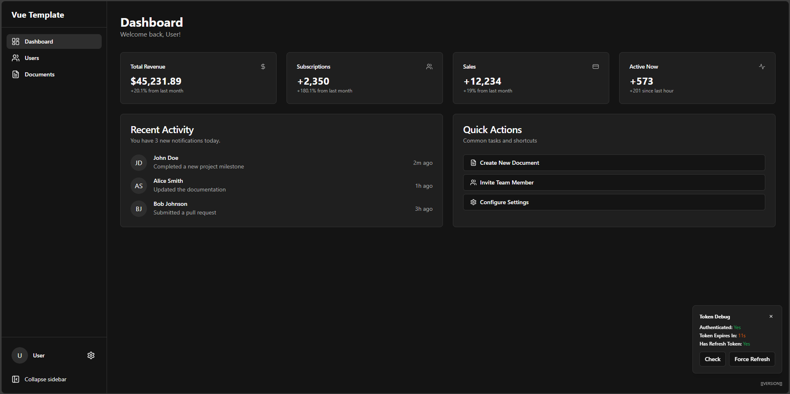

# Vue Template

Production-ready Vue 3 template with TypeScript, KeyCloak, Pinia, Shadcn, Tailwind, Vite

> **🚀 Want to get started quickly?** See [QUICKSTART.md](./docs/QUICKSTART.md) 

| Light | Dark |
|---------|---------|
|  |  |

## Project Structure

```
vue-template/
├── public/           # Static assets (favicon, SSO check)
├── build/            # Docker build files
├── src/
│   ├── assets/       # CSS & Tailwind imports
│   ├── components/   # Layout & UI components (shadcn-vue)
│   ├── lib/          # Utilities
│   ├── router/       # Vue Router config
│   ├── services/     # External services (Keycloak)
│   ├── stores/       # Pinia stores
│   ├── types/        # TypeScript types
│   ├── views/        # Pages (Dashboard, Login, 404)
│   ├── App.vue
│   └── main.ts
├── index.html
├── package.json
├── vite.config.ts
├── tsconfig.json
└── docker-compose.yml

```

## Technologies

- **Core:** Vue 3, TypeScript, Vite
- **State & Routing:** Pinia, Vue Router
- **UI & Styling:** Tailwind, shadcn-vue, Lucide Icons
- **Auth:** Keycloak with PKCE flow
- **Dev Tools:** Vitest, ESLint, Prettier

## Getting Started 
### NPM

#### Prerequisites
- Node.js 18+
- npm, yarn, or pnpm

#### Installation

1. Install dependencies:
```bash
npm install
```

2. Configure environment variables:
```bash
cp .env.example .env
```

Edit `.env` with your Keycloak configuration:
```env
VITE_KEYCLOAK_URL=https://your-keycloak-domain.com
VITE_KEYCLOAK_REALM=your-realm
VITE_KEYCLOAK_CLIENT_ID=your-client-id
VITE_APP_TITLE=Vue Template
VITE_API_BASE_URL=https://api.example.com
```

3. Start development server:
```bash
npm run dev
```

4. Open your browser at `http://localhost:3000`

### Docker

#### Build and Run

**Important**: Environment variables are baked into the build at compile time.


#### Using Docker Compose (with Keycloak)

The docker-compose setup includes:
- **Vue App** - Running on port 8080
- **Keycloak** - Running on port 8081
- **PostgreSQL** - Database for Keycloak

##### Option A: Build Inside Docker (reads from .env)
Docker Compose reads environment variables from your `.env` file automatically.

```bash
# 1. Edit .env file with your settings
# 2. Build and start
docker-compose up -d --build
```

All `VITE_*` variables in `.env` are automatically passed to the build.

##### Option B: Build Locally (using .env file)
Build on your machine using your `.env` file, then deploy.

```bash
# Build locally (uses .env file)
npm install
npm run build

# Deploy to Docker
docker-compose -f docker-compose.local.yml up -d
```

**Why two options?**
- Vite needs env vars at **build time**, not runtime
- `--env-file` only works at runtime, so it won't work for Vite
- Build args (Option A) = env vars available during Docker build
- Local build (Option B) = simpler, uses your `.env` file

Access the services:
- **Vue App**: http://localhost:8080
  - Username: `demo`
  - Password: `demo`
- **Keycloak Admin**: http://localhost:8081
  - Username: `admin`
  - Password: `admin`


### Keycloak Setup in Docker

#### Option 1: Automated Setup (Recommended)

After starting docker-compose, run the setup script:

```bash
# Start all services
docker-compose up -d

# Wait for services to be ready, then run setup
./build/keycloak-setup.sh
```

This will automatically:
- Create the `vue-app` realm
- Configure the `vue-template` client with PKCE
- Create a test user (`demo/demo`)

Then update your `.env`:
```env
VITE_KEYCLOAK_URL=http://localhost:8081
VITE_KEYCLOAK_REALM=vue-app
VITE_KEYCLOAK_CLIENT_ID=vue-template
```

#### Option 2: Manual Setup

1. Access Keycloak admin console at http://localhost:8081
2. Login with `admin/admin`
3. Create a new realm (e.g., `vue-app`)
4. Create a new client:
   - Client ID: `vue-template`
   - Client authentication: OFF (public client)
   - Standard flow: ON
   - Valid redirect URIs: `http://localhost:8080/*`, `http://localhost:3000/*`
   - Web origins: `http://localhost:8080`, `http://localhost:3000`
5. Create a test user with password
6. Update your `.env` file as shown above


## Authentication Flow

1. User visits the application
2. Keycloak initialization checks for existing session
3. If not authenticated, user is redirected to login page
4. User clicks "Sign in with Keycloak"
5. User authenticates with Keycloak (PKCE flow)
6. Tokens are received:
   - **Access token** stored in memory
   - **Refresh token** stored in memory. It should be later stored as a secure, HttpOnly cookie (needs backend to do so)
7. User is redirected to dashboard
8. Access token automatically refreshed before expiration

## Environment Variables

All environment variables must be prefixed with `VITE_` to be accessible in the application.

| Variable                  | Required | Default           | Description                            |
|----------------------------|----------|-----------------|----------------------------------------|
| `VITE_KEYCLOAK_URL`       | Yes      | -               | Your Keycloak server URL               |
| `VITE_KEYCLOAK_REALM`     | Yes      | -               | Keycloak realm name                    |
| `VITE_KEYCLOAK_CLIENT_ID` | Yes      | -               | Keycloak client ID                     |
| `VITE_APP_TITLE`           | No       | "Vue Template"  | Application title                      |
| `VITE_API_BASE_URL`        | No       | -               | Base URL for backend API calls         |
| `VITE_APP_DEBUG`           | No       | false           | Show token debug panel (`true`/`false`)|
